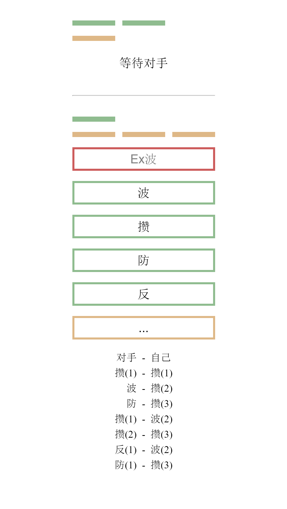

# 波波攒

自动匹配对手，休闲娱乐，弹幕

Vue.js, WebSocket, Golang

    go build
    ./bbz2

# 规则

初始双方有 +3hp +0气

攒 -> 攒气 +1气（用于发波，反弹）

防 -> 防御（普通波 -0hp，Ex波 -1hp）

波 -> 对手 -1hp，自己 -1气

Ex波 -> 对手 -2hp，自己 -3气

反 -> 反弹本次应受到的伤害，-1气

